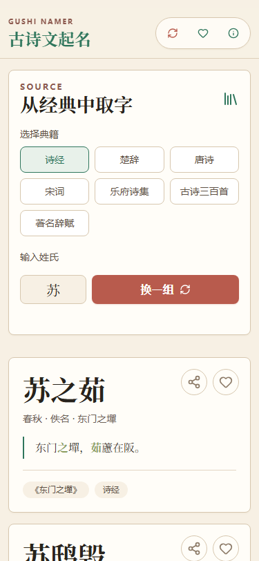
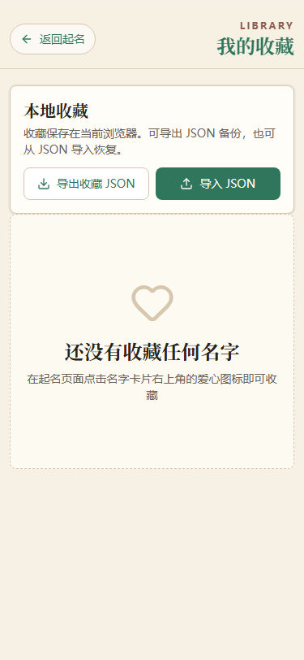
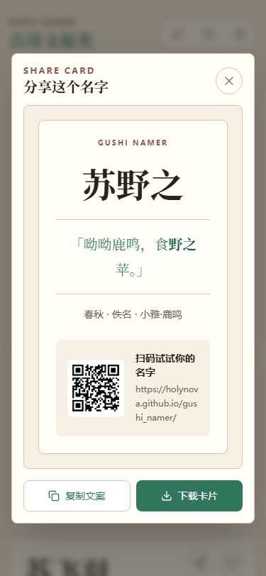

# 古诗文起名

翻阅经典，与一个好名字不期而遇。

古诗文起名从《诗经》《楚辞》、唐诗、宋词等典籍中取字组合名字，并保留诗句出处。v3.0 版本重新设计了桌面端与移动端体验，支持本地收藏、JSON 导入导出和名字分享卡片。

## Demo

- [https://holynova.github.io/gushi_namer/](https://holynova.github.io/gushi_namer/)
- [http://xiaosang.net/gushi_namer/](http://xiaosang.net/gushi_namer/)

## 截图预览

### 桌面端

| 起名首页 | 收藏与 JSON 导入导出 | 分享卡片 |
| --- | --- | --- |
|  |  |  |

### 移动端

| 起名首页 | 收藏与 JSON 导入导出 | 分享卡片 |
| --- | --- | --- |
|  |  |  |

## 第一次起名

1. 打开 Demo，从典籍列表中选择一个来源，查看生成的候选名字与原诗句。
2. 收藏喜欢的名字，再到收藏页查看或生成分享卡片。
3. 需要换设备时，先导出 JSON，再在目标浏览器导入。收藏保存在当前浏览器，清理站点数据前请先备份。

## 主要功能

- 启动后自动生成 6 个候选名字，切换典籍后立即刷新。
- 收藏数据保存在当前浏览器，无需登录。
- 支持收藏记录 JSON 导出和导入，方便备份迁移。
- 支持生成名字分享卡片，包含原诗句、出处、项目链接和二维码。
- 移动端滚动时头部自动收起，保留换一组、收藏、关于三个快捷入口。

## 支持的典籍

1. 诗经
2. 楚辞
3. 唐诗
4. 宋词
5. 乐府诗集
6. 古诗三百首
7. 著名辞赋

## 本地运行

```bash
git clone https://github.com/holynova/gushi_namer.git
cd gushi_namer
pnpm install --frozen-lockfile
pnpm dev
```

构建：

```bash
pnpm build
```

## 开源

- [GitHub 仓库](https://github.com/holynova/gushi_namer)
- 作者：[holynova](https://github.com/holynova)

## Star History

[](https://www.star-history.com/#holynova/gushi_namer&Date)

## Demo 分享卡片

[](https://holynova.github.io/gushi_namer/)

移动端友好的在线 Demo：Chinese baby name generator from classical poems and ancient texts 扫码或点击卡片打开：<https://holynova.github.io/gushi_namer/>

